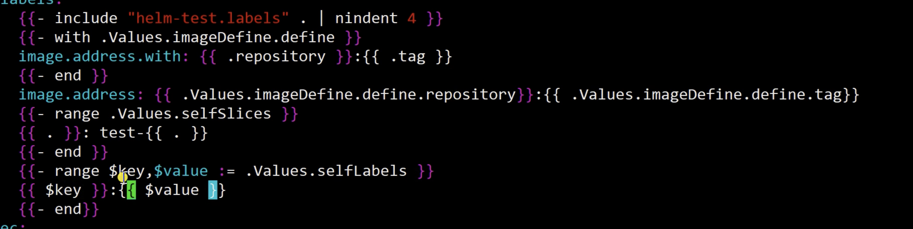

# helm

https://helm.sh/zh/docs/intro/quickstart/

```
https://helm.sh/zh/docs/intro/using_helm/
https://helm.sh/zh/docs/chart_template_guide/values_files/
https://www.jianshu.com/p/00ba63e5fa51
https://blog.csdn.net/fly910905/article/details/120951307
```

## 二进制安装

```bash
wget https://get.helm.sh/helm-v3.9.0-linux-amd64.tar.gz
wget http://8.140.155.94/download/helm-v3.9.0-linux-amd64.tar.gz
tar -zxvf helm-v3.9.0-linux-amd64.tar.gz
sudo mv linux-amd64/helm /usr/local/bin/helm
```

## 添加bitnami和官方仓库

```bash
helm repo add bitnami https://charts.bitnami.com/bitnami
helm repo add stable https://charts.helm.sh/stable
```

## 基础命令

```bash
基础命令：
	下载一个包：helm pull
	创建一个包：helm create
	安装一个包：helm install
	查看：helm list
	查看安装参数：helm get values
	更新：helm upgrade
	删除：helm delete
```

**查找包**

```
helm search repo zookeeper
```

## 报错8080 connection refused

```
export KUBECONFIG=/etc/rancher/k3s/k3s.yaml
sudo chmod 744 /etc/rancher/k3s/k3s.yaml
```

## 安装zookeeper

```bash
helm pull bitnami/zookeeper
tar xf zookeeper-9.1.6.tgz
cd zookeeper
vi values.yaml
```

如果没有持久化存储，就把values.yaml中persistence：enabled改成false

- 如果有的话，就把storageClass后面修改name名

然后把副本数改一下，replicaCount可以改成3，搭建集群

镜像地址可以改一下，改成公司内部的，然后auth关掉，改成false

**values.yaml是配置全局的变量，最后会复制给所有的参数**

执行命令

```bash
helm install -n public-service zookeeper  .
```

执行结果

```
jun_yuan@ubuntu-DeepLearning-2602004:~/zookeeper$ helm install -n public-service zookeeper  .
WARNING: Kubernetes configuration file is group-readable. This is insecure. Location: /etc/rancher/k3s/k3s.yaml
WARNING: Kubernetes configuration file is world-readable. This is insecure. Location: /etc/rancher/k3s/k3s.yaml
NAME: zookeeper
LAST DEPLOYED: Thu May 26 23:16:05 2022
NAMESPACE: public-service
STATUS: deployed
REVISION: 1
TEST SUITE: None
NOTES:
CHART NAME: zookeeper
CHART VERSION: 9.1.6
APP VERSION: 3.8.0

** Please be patient while the chart is being deployed **

ZooKeeper can be accessed via port 2181 on the following DNS name from within your cluster:

    zookeeper.public-service.svc.cluster.local

To connect to your ZooKeeper server run the following commands:

    export POD_NAME=$(kubectl get pods --namespace public-service -l "app.kubernetes.io/name=zookeeper,app.kubernetes.io/instance=zookeeper,app.kubernetes.io/component=zookeeper" -o jsonpath="{.items[0].metadata.name}")
    kubectl exec -it $POD_NAME -- zkCli.sh

To connect to your ZooKeeper server from outside the cluster execute the following commands:

    kubectl port-forward --namespace public-service svc/zookeeper 2181: &
    zkCli.sh 127.0.0.1:2181
```

**安装方式二：安装kafka**

如果安装失败，更新一下repo，``helm repo update``

```
Error: INSTALLATION FAILED: failed to download "bitnami/kafka"
```

执行命令

```bash
helm install kafka bitnami/kafka --set zookeeper.enabled=false --set replicaCount=3 --set externalZookeeper.servers=zookeeper --set persistence.enabled=false -n public-service
```

运行结果

```bash
NAME: kafka
LAST DEPLOYED: Fri May 27 10:09:34 2022
NAMESPACE: public-service
STATUS: deployed
REVISION: 1
TEST SUITE: None
NOTES:
CHART NAME: kafka
CHART VERSION: 17.1.0
APP VERSION: 3.2.0

** Please be patient while the chart is being deployed **

Kafka can be accessed by consumers via port 9092 on the following DNS name from within your cluster:

    kafka.public-service.svc.cluster.local

Each Kafka broker can be accessed by producers via port 9092 on the following DNS name(s) from within your cluster:

    kafka-0.kafka-headless.public-service.svc.cluster.local:9092
    kafka-1.kafka-headless.public-service.svc.cluster.local:9092
    kafka-2.kafka-headless.public-service.svc.cluster.local:9092

To create a pod that you can use as a Kafka client run the following commands:

    kubectl run kafka-client --restart='Never' --image docker.io/bitnami/kafka:3.2.0-debian-10-r4 --namespace public-service --command -- sleep infinity
    kubectl exec --tty -i kafka-client --namespace public-service -- bash

    PRODUCER:
        kafka-console-producer.sh \
            
            --broker-list kafka-0.kafka-headless.public-service.svc.cluster.local:9092,kafka-1.kafka-headless.public-service.svc.cluster.local:9092,kafka-2.kafka-headless.public-service.svc.cluster.local:9092 \
            --topic test

    CONSUMER:
        kafka-console-consumer.sh \
            
            --bootstrap-server kafka.public-service.svc.cluster.local:9092 \
            --topic test \
            --from-beginning
```

**查看应用，helm3有命名空间**

```
helm list -n public-service
helm get values kafka -n public-service
```

### 测试kafka集群

```
kubectl run kafka-client --restart='Never' --image docker.io/bitnami/kafka:2.8.0-debian-10-r30 --namespace public-service --command -- sleep infinity
```

## Helm v3 Chart目录层级解析

创建一个包

```
helm create helm-test
```

并不想安装，只是想看一下模版长什么样子

```
helm install helm-test . --dry-run
```

## 使用Helm Chart安装Rabbitmq

### 下载yaml文件

```bash
git clone https://github.com/dotbalo/k8s.git
```

### Helm创建rabbitmq配置

```bash
helm create rabbitmq-cluster
```

进入templates目录，删除不需要的文件

```
cd rabbitmq-cluster/templates/
rm -rf deployment.yaml  hpa.yaml service.yaml  ingress.yaml  serviceaccount.yaml  tests
```

把上面下载的yaml文件，复制到templates中

```
cp -rp *.yaml ../../rabbitmq-cluster/templates/
```

### 开始配置

values.yaml文件中将副本数设置为3个``replicaCount: 3``

然后在``rabbitmq-cluster-ss.yaml ``文件中进行修改副本数为变量

```
vi rabbitmq-cluster-ss.yaml 
# 将spec.replicas设置为 {{ .Values.replicaCount }}
# 将metadata.namespace设置为 {{ .Release.Namespace }}
# 将metadata.name设置为{{ .Release.Name }}
# 将metadata.labels.app设置为{{ .Release.Name }}
测试一下
helm install rmq . -n public-service --dry-run
```

### 使用模版

_help文件中有个label``rabbitmq-cluster.selectorLabels``

将template中``rabbitmq-cluster-ss.yaml``文件spec.selector.matchLabels进行修改

```bash
spec:
  replicas: {{ .Values.replicaCount }}
  selector:
    matchLabels:
      {{- include "rabbitmq-cluster.selectorLabels" . | nindent 6 }}
```

接着修改spec.template.metadata.labels

```
spec:
  replicas: {{ .Values.replicaCount }}
  selector:
    matchLabels:
      {{- include "rabbitmq-cluster.selectorLabels" . | nindent 6 }}
  serviceName: rmq-cluster
  template:
    metadata:
      labels:
        {{- include "rabbitmq-cluster.selectorLabels" . | nindent 8 }}
```

Spec.serviceName也可以修改，修改前

```
spec:
  replicas: {{ .Values.replicaCount }}
  selector:
    matchLabels:
      {{- include "rabbitmq-cluster.selectorLabels" . | nindent 6 }}
  serviceName: rmq-cluster
```

service的名称可以在values.yaml中进行添加

```yaml
loadbalancerService:
	type: ClusterIP
	name: rmq-cluster-loadbalancer
headlessService:
	name: rmq-cluster-headless
```

修改后

```yalm
spec:
  replicas: {{ .Values.replicaCount }}
  selector:
    matchLabels:
      {{- include "rabbitmq-cluster.selectorLabels" . | nindent 6 }}
  serviceName: {{ .Values.headlessService.name }}
```

最下面-name：K8S_SERVICE_NAME的value中修改``{{ .Values.headlessService.name }}``

```
    		- name: K8S_SERVICE_NAME
          value: {{ .Values.headlessService.name }}
        - name: POD_IP
```

**继续修改**

修改镜像地址有几种方式：

- 可以直接写镜像地址
  - ``imageAddress: registry.cn-beijing.aliyuncs.com/dotbalo/rabbitmq:3.7-management``
- 也可以拆分的写

直接写，在values.yaml文件中

```yaml
image:
	address: registry.cn-beijing.aliyuncs.com/dotbalo/rabbitmq:3.7-management
	pullPolicy: IfNotPresent
```

在ss.yaml文件中修改

```yaml
        - name: RABBITMQ_NODENAME
          value: rabbit@$(POD_NAME).{{ .Values.headlessService.name }}.$(POD_NAMESPACE).svc.cluster.local
        - name: RABBITMQ_CONFIG_FILE
          value: /var/lib/rabbitmq/rabbitmq.conf
        image: {{ .Values.image.address }}
        imagePullPolicy: {{ .Values.image.pullPolicy }}
```

**继续修改secret**

在values.yaml中修改

```
imagePullSecrets:
  - name: test1
  - name: test2
```

imagePullSecrets和containers是同级的

```
  template:
    metadata:
      labels:
        {{- include "rabbitmq-cluster.selectorLabels" . | nindent 8 }}
    spec:
      {{- with .Values.imagePullSecrets }}
      imagePullSecrets:
        {{- toYaml . | nindent 8 }}
      {{- end }}
      containers:
```

### 开始修改configmap

首先改命名空间

metadata.namespace修改``{{ .Release.Namespace }}``

```
kind: ConfigMap
apiVersion: v1
metadata:
  name: rmq-cluster-config
  namespace: {{ .Release.Namespace }}
  labels:
    addonmanager.kubernetes.io/mode: Reconcile
data:
    enabled_plugins: |
      [rabbitmq_management,rabbitmq_peer_discovery_k8s].
    rabbitmq.conf: |
      loopback_users.guest = false

      default_user = {{ default "admin" .Values.username }}
      default_pass = {{ default "password" .Values.password }}
       ## Clustering
      cluster_formation.peer_discovery_backend = rabbit_peer_discovery_k8s
      cluster_formation.k8s.host = kubernetes.default.svc.cluster.local
      cluster_formation.k8s.address_type = hostname
      #################################################
      # public-service is rabbitmq-cluster's namespace#
      #################################################
      cluster_formation.k8s.hostname_suffix = .{{ .Values.headlessService.name  }}.{{ .Release.Namespace }}.svc.cluster.local
```

### rbrc

ServiceAccount需要改一下

都改一下命名空间

```
apiVersion: v1
kind: ServiceAccount
metadata:
  name: rmq-cluster
  namespace: {{ .Release.Namespace }}
```

### loadbalance

name和namespace改一下

```
kind: Service
apiVersion: v1
metadata:
  labels:
    app: {{ .Release.Name }}
    type: LoadBalancer
  name: {{ .Values.loadbalancerService.name }}
  namespace: {{ .Release.Namespace }}
spec:
  ports:
  - name: http
    port: 15672
    protocol: TCP
    targetPort: 15672
  - name: amqp
    port: 5672
    protocol: TCP
    targetPort: 5672
  selector:
    {{- include "rabbitmq-cluster.selectorLabels" . | nindent 4 }}
  type: {{ .Values.loadbalancerService.type }}
```

### 修改serice

```
apiVersion: v1
metadata:
  labels:
    app: {{ .Release.Name }}
  name: {{ .Values.headlessService.name }}
  namespace: {{ .Release.Namespace }}
spec:
  clusterIP: None
  ports:
  - name: amqp
    port: 5672
    targetPort: 5672
  selector:
    {{- include "rabbitmq-cluster.selectorLabels" . | nindent 4 }}
```

### 修改screat

```
kind: Secret
apiVersion: v1
metadata:
  name: rmq-cluster-secret
  namespace: {{ .Release.Namespace }}
stringData:
  cookie: ERLANG_COOKIE
  password: {{ .Values.password }}
  url: amqp://{{ .Values.username }}:{{ .Values.password }}@{{ .Values.loadbalancerService.name }}
  username: {{ .Values.username }}
type: Opaque
```

### 安装

```
~/rabbitmq-cluster$ helm install rabbitmq-cluster . -n public-service
WARNING: Kubernetes configuration file is group-readable. This is insecure. Location: /etc/rancher/k3s/k3s.yaml
WARNING: Kubernetes configuration file is world-readable. This is insecure. Location: /etc/rancher/k3s/k3s.yaml
NAME: rabbitmq-cluster
LAST DEPLOYED: Sun May 29 17:05:32 2022
NAMESPACE: public-service
STATUS: deployed
REVISION: 1
TEST SUITE: None
NOTES:
1. Get the application URL by running these commands:
   Rabbitmq已安装
```

## 公司项目



helm安装命令

```
helm install -n public-service textin-studio .
helm install -n public-service textin-studio . --dry-run
helm install -n public-service textin-studio . --dry-run --disable-openapi-validation
```

uninstall

```
helm uninstall -n public-service textin-studio
```

git

```
git add .
git commit -m "update"
git push
```

#### 安装

```
cd /home/jun_yuan/textin-studio-k3s/manifest
kubectl apply -f ingress-nginx.yaml
kubectl apply -f vscode.yaml
kubectl apply -f web.yaml 
kubectl apply -f user-manager.yaml 
kubectl apply -f testing.yaml
kubectl apply -f registry.yaml
kubectl apply -f redis.yaml
kubectl apply -f recognize_document.yaml
kubectl apply -f prometheus.yaml
kubectl apply -f product.yaml
kubectl apply -f oven.yaml
kubectl apply -f nvidia-device-plugin.yaml
# kubectl apply -f node-exporter.yaml
kubectl apply -f mysql.yaml
kubectl apply -f mongo.yaml
kubectl apply -f minio.yaml
kubectl apply -f ingress-nginx.yaml
kubectl apply -f erase_words.yaml
kubectl apply -f dcgm_exporter.yaml
kubectl apply -f data_generation.yaml
kubectl apply -f dashboard.yaml 
kubectl apply -f common.yaml
kubectl apply -f citadel_warehouse.yaml
kubectl apply -f argo-roles.yaml 
kubectl apply -f argo.yaml
kubectl apply -f anchor_tasks.yaml
sudo k3s kubectl  delete -f node-exporter.yaml
# sudo k3s kubectl delete --all pods -n default
```


#### 卸载

```
kubectl delete secret platform-key-secrets
kubectl delete deploy/user-manage
kubectl delete service/user-manage
kubectl delete ingress/user-manage
kubectl delete deploy/web
kubectl delete service/web
kubectl delete ingress/web
kubectl delete deploy/vscode
kubectl delete service/vscode
kubectl delete ingress/vscode
kubectl delete role testing-role
kubectl delete RoleBinding testing-role-binding
kubectl delete deploy/recognize-document
kubectl delete svc/recognize-document
kubectl delete ClusterRole prometheus-server
kubectl delete ClusterRoleBinding prometheus-server
kubectl delete ServiceAccount auto-training
kubectl delete ConfigMap customized-nvidia-device-plugin -n kube-system
kubectl delete DaemonSet nvidia-device-plugin-daemonset -n kube-system
kubectl delete Deployment argo-server -n argo
kubectl delete all --all -n argo
kubectl delete svc kubernetes-dashboard -n kubernetes-dashboard
kubectl delete all --all -n kubernetes-dashboard
kubectl delete ClusterRole kubernetes-dashboard
kubectl delete all --all -n ingress-nginx
kubectl delete ClusterRole ingress-nginx
kubectl delete ClusterRoleBinding ingress-nginx
kubectl delete ServiceAccount ingress-nginx
kubectl delete namespace ingress-nginx
kubectl delete configmap ingress-nginx-controller
kubectl delete Service prometheus-server
kubectl delete Deployment prometheus-server
kubectl delete ClusterRole prometheus-server
kubectl delete ServiceAccount prometheus-server
cd ~/k3s-manifest/

```

**安装**

```
sudo k3s kubectl apply -f yamls/
```

**删除**

```
cd ~/textin-studio-k3s/
sudo k3s kubectl delete -f yamls/
cd ~/k3s-manifest/
```

**new**

```
git pull
cp -r templates/ back
mv templates/dashboard.yaml .
rm -f templates/*
mv dashboard.yaml templates/


cd ~/textin-studio-k3s/
sudo k3s kubectl delete -f yamls/dashboard.yaml
cd ~/k3s-manifest/
helm install -n public-service textin-studio . --dry-run


cd ~/textin-studio-k3s/
sudo k3s kubectl apply -f yamls/dashboard.yaml
```

